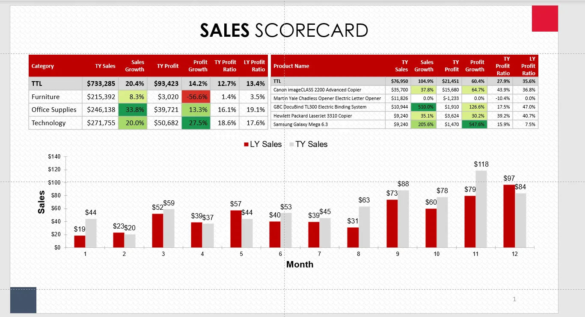

As a data scientist, you draw insights from data and present it in a informative and visually appealing way. There are good tools (Tableau, Looker, Power BI) to help you tell the story, while what if your boss prefers PowerPoint?

It is not hard to make PowerPoint, but it takes time and effort. You must be patient enough to adjust each font size and make sure all elements aligned. Besides, you must get very good stamina, if your PowerPoint is 100 pages. What’s more, one single change happened, and you need to redo the slides again. Believe me, that’s not fun.

Luckily, the Officer packages (developed by [ArData](https://www.ardata.fr/), a French data consultancy) provide a solution for users to manipulate the doc and pptx documents.

This article, I will show you how to create a simple scorecard deck by region using Officer, mschart and flextable packages. Code and Data could be found in my [GitHub repo](https://github.com/WenxuanZhang/Powerpoint-Automation)

The data used here is the superstore data. The Template is the Balanced Score Card template.



## 1. Create PPT
You can create an blank ppt or using a template as the starting point.

```
my_pres <- read_pptx() 
my_pres <- add_slide(my_pres, layout = “Title and Content”, master = “Office Theme”)
print(my_pres,’example1.pptx’)
#using template 
my_pres <- read_pptx('PerformanceScoreCard1.pptx') 
my_pres <- add_slide(my_pres, layout = "Title and Content", master = "Office Theme")
print(my_pres,'example2.pptx')

```
## 2. Location 
To add elements to the location that you desired, there are two main approach in Officer: using elements in template or free location.

```
my_pres <- read_pptx('PerformanceScoreCard1.pptx') 
my_pres <- add_slide(my_pres)
title_name <- toupper(paste('WEST','SALES SCORECARD', sep = " "))
paragraph <- fpar(ftext(title_name,
                        fp_text( font.size = 32,bold = TRUE,color = "black",
                                 font.family = "Century Gothic (Headings)")),fp_p = fp_par(text.align = "center"))
# using free location
tt_loc <- ph_location(left =1.59, top =0.31 , width =10.16 , height = 0.56)
my_pres <- ph_with(my_pres, value = paragraph, 
                   location = tt_loc)
# using elements in power point
my_pres <- add_slide(my_pres)
my_pres <- ph_with(my_pres, value = paragraph, 
                   location = ph_location_type('body'))
print(my_pres,'example.pptx')

```


To get location, all you need to do is to leverage the ppt guideline to identify the location.

For example, the very center of a power point slide is (0,0) while in officer R, the (0,0) point is the top left corner. Thus, the center point in the officer R will be left = 6.67, top = 3.75). You could find the location of any point in a slides using this method.


To pin point the location of current slides, using

```
layout_properties ( x = mypres, layout = "Title and Content" )
```


## 3. Add Table
In the scorecard, there are two tables. One is the category summary and another is the top 5 products. The details of how this table was calculated will not be discussed here.

The data could be added to the powerpoint in flextable object.

```
cate_table <- cate_summary(regions,data)
t1_loc <- ph_location(left = 0.45, top = 1.2)
cate_table_ft <- flextable(cate_table)
my_pres <- ph_with(my_pres, value = cate_table_ft, 
                   location = t1_loc)
print(my_pres,'example.pptx')

```


However, this table does not look quite like the original one on the scorecard. We need to remove the borderline, change the header color, format the number, redefine the column width and height and create the heat map using the code below (details of the get color could be found here).

```
all_table_format <- function(prod_table){
  row_num <- dim(prod_table)[1]
  ft <- flextable(prod_table)
  ft <- ft %>% border_remove()%>%surround(
    border = fp_border_default(color = "grey", width = 1))
  ft <- ft %>% font(font= "Calibri",part = 'all')
  ft <- ft %>% bg(bg = "#C00000",part = 'header')
  ft <- ft %>% bold(i = 1,part ='header')%>%
    color(i =1,color = 'white',part = 'header')
  ft <- ft %>% set_formatter(`Sales Growth` = function(x) sprintf( "%.1f%%", x*100),
                             `Profit Growth` = function(x) sprintf( "%.1f%%", x*100),
                             `TY Profit Ratio` = function(x) sprintf( "%.1f%%", x*100),
                             `LY Profit Ratio` = function(x) sprintf( "%.1f%%", x*100))
  ft <- ft %>% colformat_num(j = c(2,4), prefix = "$")
  ft <- ft %>% bg(bg = "#D9D9D9",i = 1, part = 'body')%>%bold(i =1,part ='body')
  ft <- ft %>% fontsize(size = 10.5, part = 'header')
  ft <- ft %>% bg(i = c(2:row_num),j = 3,bg = get_color(prod_table,3)[2:row_num],part = 'body')
  ft <- ft %>% bg(i = c(2:row_num) ,j = 5,bg = get_color(prod_table,5)[2:row_num],part = 'body')
  return(ft)
}
cate_table <- cate_summary(regions,data)
t1_loc <- ph_location(left = 0.45, top = 1.2)
#cate_table_ft <- flextable(cate_table)
cate_table_ft <- all_table_format(cate_table)
cate_table_ft <- cate_table_ft %>% fontsize(size = 14, part = 'body')%>%
  width(j = c(1,2,4),width = c(1.3,0.88,0.84))%>%
  width(j = c(3,5,6,7), width = c(0.7))%>%
  height(height = 0.32 ,part = 'body')%>%
  height(height = 0.54, part = 'header')%>%fontsize(size = 13,part = 'body')
my_pres <- ph_with(my_pres, value = cate_table_ft, 
                   location = t1_loc)
print(my_pres,'example.pptx')

```


## 4. Add Chart

The mschart package provides a method to generate powerpoint chart. It supports bar, line, scatter, and area map, however, the combo chart is not supported at this point.

Adding a chart in the powerpoint is similar.

Prepare data
Plot the chart
Formatting the chart
Add a chart to powerpoint

```
###Adding chart 
# preparing data 
c3_loc <- ph_location(left = 0.45, top = 3.15,width = 12.46, height = 3.46)
month_table <- month_summary(regions,data)
month_table <- month_table %>%pivot_longer(!Month, names_to = "Metrics", values_to = "Sales")
month_table <- month_table %>% mutate(Month = as.factor(Month))
month_table <- month_table %>% mutate(ksales = paste('$',round(Sales/1000,0),sep = ""))
my_barchart <- ms_barchart(data = month_table , 
                           x = "Month", y = "Sales", group = "Metrics",labels = "ksales")  
#change lable setting 
fp_text_settings <- list(
  `LY Sales` = fp_text(font.size = 12),
  `TY Sales` = fp_text(font.size = 12)
)
my_barchart <- chart_labels_text( my_barchart,
                                  values = fp_text_settings )
my_barchart <- chart_data_labels(my_barchart, position = "outEnd")
#change fill color and borderline 
my_barchart<- chart_data_fill(my_barchart,
                              values = c(`TY Sales` = "#D9D9D9", `LY Sales` = "#C00000"))
my_barchart <- chart_data_stroke(my_barchart, values = "transparent" )
#change lengend position and remove border line 
my_theme <- mschart_theme(legend_position = 't',grid_major_line = fp_border(color = "#99999999", style = "none"))
my_barchart <- set_theme(my_barchart, my_theme)
#change y axis format 
my_barchart<- chart_ax_y(my_barchart,num_fmt = '$#,##0,')
#add chart to table
my_pres <- ph_with(my_pres, value = my_barchart,
                   location = c3_loc)

```


Using similar method, you could create scorecards for the rest of the region.

Hope this is helpful. Any discussion is welcome!

The cheatsheet of officer R could be found [here](https://github.com/WenxuanZhang/Powerpoint-Automation/blob/main/Power%20Point%20Element.docx%20(1).pdf)

